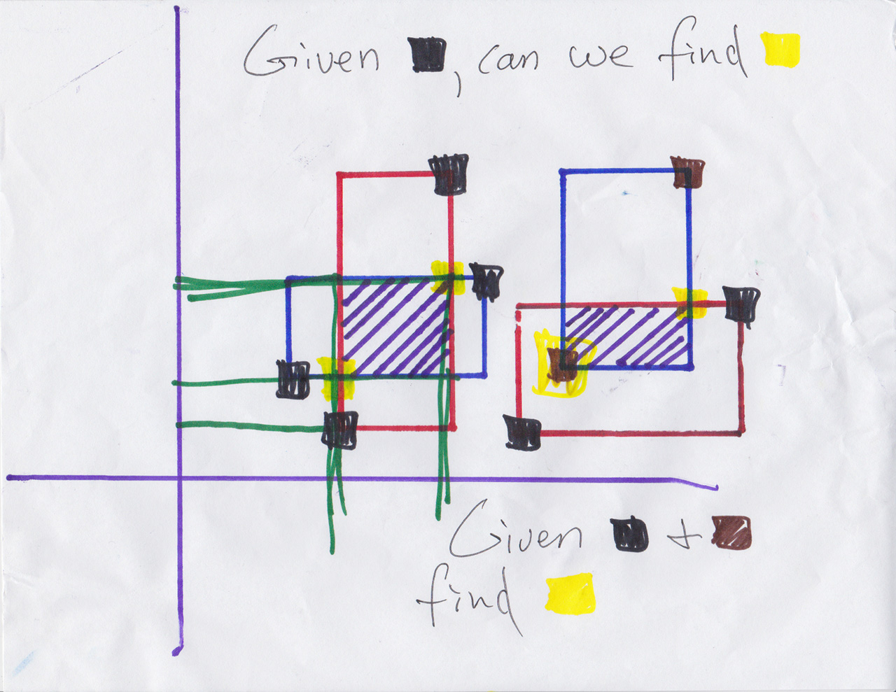
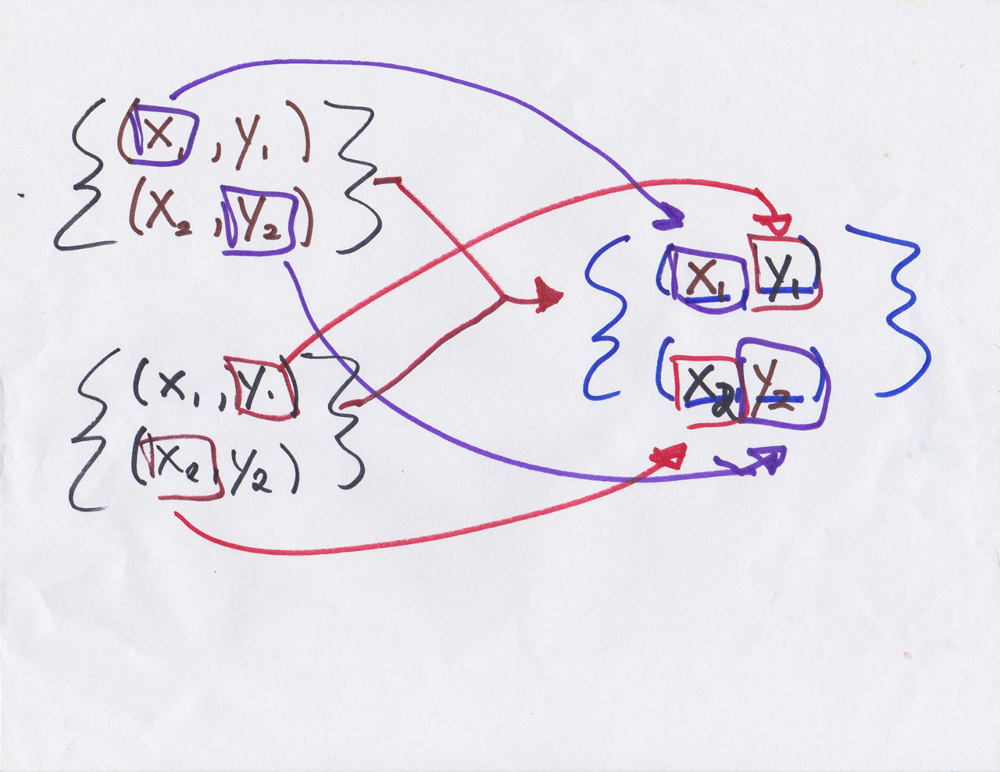

# Topics in CS

## November 20, 2014

## Interview Problems

1. [Rectangle Intersection](#rectangle-intersection)
2. [Parens Matching](#parens-matching)

### Rectangle Intersection

Write a function that takes two rectangles as arguments and returns the rectangle formed from their intersection.  Rectangles will be represented by a map with keys `(x, y, widhth, height)`, where `(x,y)` is the coordinate of the lower left-hand corner.

```json
{
  x: 5,
  y: 4,
  width: 200,
  height: 100
}
```

**Note**: Stephens solved this but represented rectangles not as the above map but as a pair of (x,y) coordinates representing the rectangle's lower left-hand corner and upper right-hand corner, respectively.

#### Main Idea

Draw several examples!  The intersection of the two rectangles has four sides: N, E, S, and W.  For each side, it will be bounded by "farther in" of the same two sides of the original rectangle.

For example, the west side of the intersection is the eastern-most side of  of the input rectangles' two west sides, the north side is the southern-most side of the two input rectangles' two north sides, and so on.

Some pictures:

1. 
2. 

### Parens Matching

Write a function that takes as input a string containing parentheses and the position of an opening parenthesis and returns the position of the opening parenthesis' closing pair.  The string might contain non-parens characters.

#### Main Idea

Every opening parens needs a matching closing parens.  Starting at the given position, increment a counter every time we see an opening parens and decrement it every time we see a closing parens.  If we see a closing parens when the counter is 0 then we know it's the closing pair for our given opening parens.

See

1. [parens.md](parens.md)
2. [parens.rb](parens.rb)
